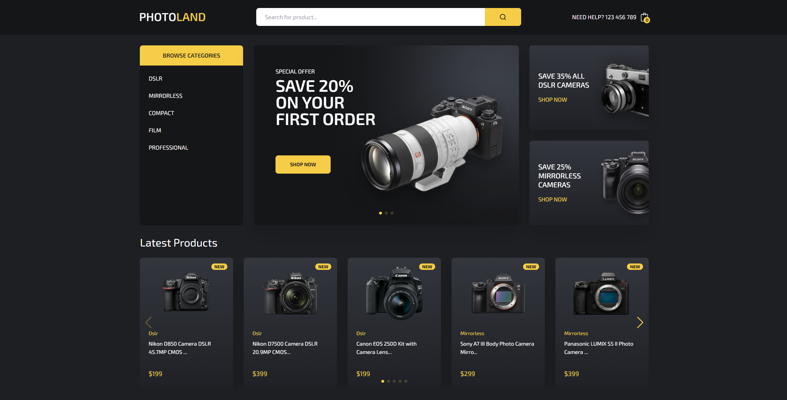

# Ecommerce Photo

## Структура проекта:
- **api/**: Содержит файлы для взаимодействия с базой данных Strapi.
- **files/**: Содержит медиафайлы и другие ресурсы.
- **public/**: Статические файлы, доступные публично, такие как изображения и HTML файлы.
- **src/**: Исходный код проекта, включая компоненты, страницы и стили.

## Основные файлы:
- **Header.js**: Компонент для отображения заголовка сайта, включает навигацию и элементы интерфейса.
- **ProductList.js**: Компонент для отображения списка продуктов, получает пропсы от родительского компонента и использует `useEffect` для загрузки данных.
- **ProductItem.js**: Отдельный компонент для отображения информации о каждом продукте, получает пропсы `product` от ProductList.
- **Cart.js**: Компонент корзины, использует `useContext` для управления состоянием корзины.
- **Footer.js**: Компонент для отображения нижней части страницы, включает контактную информацию и ссылки.
- **Hero.js**: Компонент для отображения главного рекламного баннера на главной странице.
- **CategoryNav.js**: Компонент для навигации по категориям товаров.
- **SearchForm.js**: Компонент формы поиска товаров, использует `useState` для управления состоянием ввода и `useEffect` для обработки запроса поиска.
- **Product.js**: Компонент для отображения основной информации о продукте, включая название, описание и цену.

## Основные компоненты и функции:
- **React Router**: Используется для маршрутизации и подгрузки данных без перезагрузки страницы.
- **Strapi**: База данных для хранения информации о товарах.
- **Tailwind CSS**: Используется для стилизации компонентов.
- **Next.js**: Фреймворк для React, который используется для рендеринга и управления маршрутизацией.
- **Vite**: Быстрая сборка проекта.

## Основные части и функции:
- **Поиск**: Компонент для поиска товаров.
- **Страницы товаров**: Отображают подробную информацию о каждом товаре.
- **Корзина**: Управление добавлением и удалением товаров из корзины.
- **Админ-панель**: Управление контентом через Strapi.

## Технологии и их использование:
- **React**: Используется для создания компонентов и управления состоянием приложения.
- **Next.js**: Фреймворк для React, который обеспечивает серверный рендеринг и маршрутизацию.
- **Tailwind CSS**: Утилитарный CSS-фреймворк для быстрой стилизации компонентов.
- **Strapi**: CMS, используемая для управления контентом и взаимодействия с базой данных.
- **Vite**: Инструмент для быстрой сборки и разработки, обеспечивающий мгновенную перезагрузку модулей и высокую скорость разработки.

Проект демонстрирует использование современных технологий для создания функционального и удобного e-commerce сайта.
